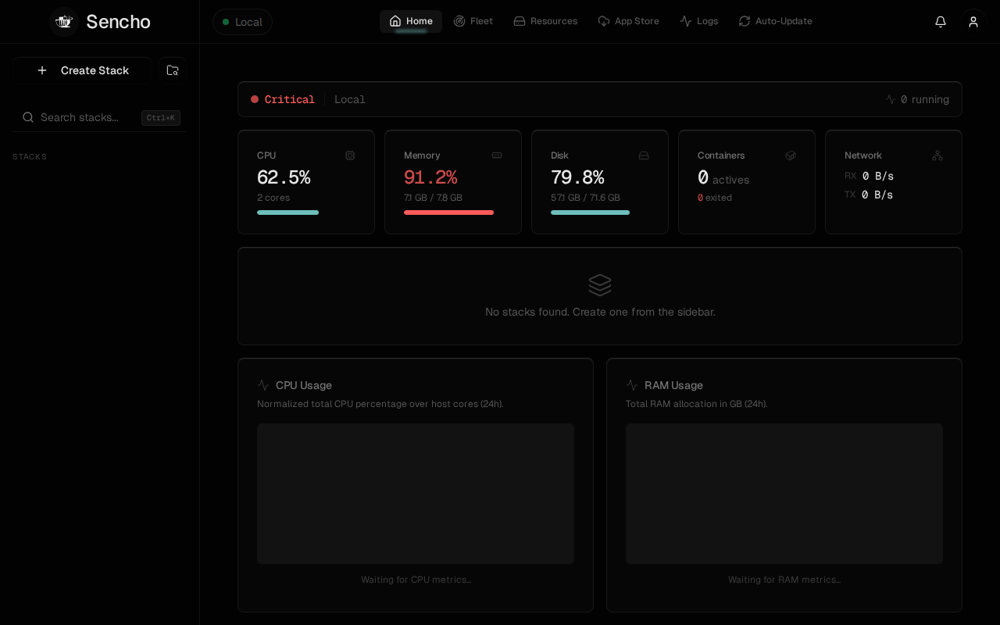

# Sencho

[](https://github.com/AnsoCode/Sencho/actions/workflows/ci.yml)
[](https://hub.docker.com/r/saelix/sencho)
[](#license)

A self-hosted Docker Compose management dashboard. Manage your stacks, containers, images, volumes, and networks through a modern web UI.



## Features

- **Stack Management** - Create, edit, start, stop, and remove Docker Compose stacks with a built-in Monaco code editor
- **Multi-Node Support** - Manage remote Sencho instances through a transparent HTTP/WebSocket proxy (Distributed API model)
- **App Store** - One-click deployment from LinuxServer.io templates with editable ports, volumes, and environment variables
- **Resource Hub** - Browse and manage images, volumes, and networks with managed/external/unused classification
- **Live Logs** - Aggregated real-time log streaming across all containers with search and filtering
- **Dashboard** - Container stats, CPU/RAM metrics, health checks, and image update notifications
- **Alerts** - Configurable threshold alerts for CPU, RAM, and disk usage
- **Terminal** - In-browser host console and container exec via WebSocket

## Quick Start

```yaml
services:
  sencho:
    image: saelix/sencho:latest
    container_name: sencho
    restart: unless-stopped
    ports:
      - "1852:1852"
    volumes:
      - /var/run/docker.sock:/var/run/docker.sock
      - ./data:/app/data
      # 1:1 Compose Path Rule: host path MUST match container path
      - /opt/docker:/opt/docker
    environment:
      - COMPOSE_DIR=/opt/docker
      - DATA_DIR=/app/data
```

```bash
docker compose up -d
```

Then open `http://your-server:1852` and create your admin account.

See the [full documentation](https://docs.sencho.io) for configuration details, multi-node setup, and more.

## Development

```bash
# Backend (Express + TypeScript)
cd backend && npm install && npm run dev

# Frontend (React + Vite)
cd frontend && npm install && npm run dev
```

The frontend dev server proxies `/api` requests to the backend on port 1852.

## Contributing

See [CONTRIBUTING.md](CONTRIBUTING.md) for development setup and PR guidelines.

## Security

See [SECURITY.md](SECURITY.md) for vulnerability reporting. **Do not open public issues for security vulnerabilities.**

## License

Sencho is licensed under the [Business Source License 1.1](LICENSE). You may use, modify, and redistribute the code freely, including for production use. The only restriction is offering Sencho as a competing hosted or managed service. On **2030-03-25**, the license automatically converts to [Apache 2.0](https://www.apache.org/licenses/LICENSE-2.0).
